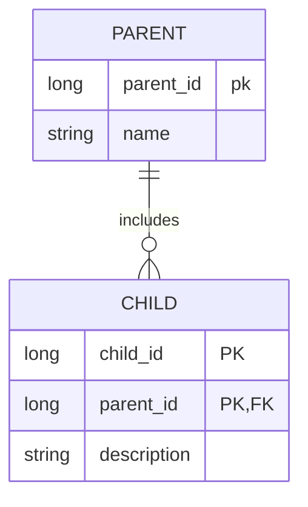

# 상속 관계 매핑

관계형 데이터베이스에는 객체지향 언어에서 다루는 상속이라는 개념이 없다. 대신 **슈퍼타입 서브타입 관계**라는 모델링 기법이 상속 개념과 가장 유사하다.  
ORM에서 이야기하는 상속 관계 매핑은 객체의 상속 구조와 데이터베이스의 슈퍼타입 서브타입 관계를 매핑하는 것이다.

- **각각의 테이블로 변환**(조인 전략): 엔티티 각각 테이블로 만들고 조회할 때 JOIN을 사용한다.
- **통합 테이블로 변환**(단일 테이블 전략): 테이블을 하나만 사용해서 통합한다.
- **서브타입 테이블로 변환**(구현 클래스마다 테이블 전략): 서브 타입마다 하나의 테이블을 만든다.

## 조인 전략(Join Strategy)

조인 전략은 엔티티 각각을 모두 테이블로 만들고 자식 테이블이 부모 테이블의 기본 키를 받아서 기본 키 + 외래 키로 사용하는 전략이다.  
따라서 조회할 때 조인을 자주 사용한다.

주의할 점은 객체는 타입으로 구분할 수 있지만 테이블은 타입의 개념이 없으므로 타입을 구분하는 컬럼을 추가해야한다.

- **장점**
    - 테이블이 정규화된다.
    - 외래 키 참조 무결성 제약조건을 활용할 수 있다.
    - 저장공간을 효율적으로 사용한다.
- **단점**
    - 조회할 떄 조인이 많이 사용되므로 성능이 저하될 수 있다.
    - 조회 쿼리가 복잡하다.
    - 데이터를 등록할 때 INSERT SQL이 두 번 실행된다.(테이블이 두 개 이상으로 나눠져 있기 때문)
- **특징**
    - JPA 표준 명세는 구분 컬럼을 사용하도록 하지만 하이버네이트를 포함한 몇몇 구현체는 구분 컬럼 없이도 동작한다.
    - 관련 어노테이션: `@PrimaryKeyJoinColumn`, `@DiscriminatorColumn`, `@DiscriminatorValue`
    
## 단일 테이블 전략(Single Table Strategy)

단일 테이블 전략은 하나의 테이블만 사용한다. 그리고 구분 컬럼으로 어떤 자식 데이터가 저장되어있는지 구분한다.  
조회할 때 조인을 사용하지 않으므로 일반적으로 가장 빠르다. 테이블 하나에 모든 것을 통합하므로 구분 컬럼이 필수로 사용해야 한다.

- **장점**
    - 조인이 필요 없으므로 일반적으로 조회 성능이 빠른 편이고 조회 쿼리가 단순하다.
- **단점**
    - 자식 엔티티가 매핑한 컬럼은 모두 null을 허용해야 한다.
    - 단일 테이블에 모든 것을 저장하므로 테이블이 커질 수 있다. 그러므로 상황에 따라서 조회 성능이 오히려 느려질 수 있다.
- **특징**
    - 구분 컬럼을 꼭 사용해야 한다.(`@DiscriminatorColumn` 설정 필수)
    - `@DiscriminatorValue`를 지정하지 않을 경우, 기본으로 엔티티 이름을 사용한다.

## 구현 클래스마다 테이블 전략(Table-per Concrete Class Strategy)

자식 엔티티마다 테이블을 만든다. 자식 테이블은 각각에 필요한 컬럼이 모두 포함되어 있다. (부모 엔티티의 컬럼 + 자기 자신의 컬럼)
해당 전략은 데이터베이스, ORM 설계 시 추천하지 않는 전략이다. 이 전략보단 조인 전략이나 단일 테이블 전략을 권장한다.

- **장점**
    - 서브 타입을 구분해서 처리할 때 효과적이다.
    - not null 제약 조건을 사용할 수 있다.
- **단점**
    - 여러 자식 테이블을 함께 조회할 때 성능이 느라다.(SQL에 UNION을 사용해야 한다.)
    - 자식 테이블을 통합해서 쿼리하기 어렵다.
- **특징**
    - 구분 컬럼을 사용하지 않는다.(부모 엔티티를 테이블로 만들지 않고 자식 테이블에 부모 엔티티의 컬럼을 포함 모든 컬럼을 포함 시키기 때문)

# `@MappedSuperclass`

부모 클래스는 테이블과 매핑하지 않고 부모 클래스를 상속 받는 자식 클래스에게 매핑 정보만 제공하고 싶으면 `@MappedSuperclass`를 사용하면 된다.  

`@MappedSuperclass`는 추상 클래스와 비슷한데 `@Entity`와 달리 테이블과 매핑되지 않는다. 해당 어노테이션은 매핑 정보를 상속할 목적으로만 사용된다.

`@AttributeOverride`, `@AttributeOverrides`는 부모로부터 물려받은 매핑 정보를 재정의할 때 사용된다.(연관관계를 재정의 `@AssociationOverride`, `@AssociationOverrides`)

- `Person.java`
    ```java
    @MappedSuperclass
    public class Person {
        @Id
        @GeneratedValue
        private Long id;

        @Column(name = "name")
        private String username;
        private int age;
    }
    ```
    - `@MappedSuperclass`를 지정한 객체는 주로 사용하는 공통의 매핑 정보를 정의한다. 그리고 자식 엔티티들은 상속을 통해 해당 객체의 매핑 정보를 물려 받는다.
- `Member.java`
    ```java
    @Entity
    @AttributeOverride(name = "id", column = @Column(name = "member_id"))
    public class Member extends Person {

        private String email;
        private String password;
    }
    ```
    - Member 테이블의 컬럼: `MEMBER_ID`|`AGE`|`NAME`|`EMAIL`|`PASSWORD`|
- `Admin.java`
    ```java
        @Entity
        @AttributeOverrides({
            @AttributeOverride(name = "id", column = @Column(name = "admin_id")),
            @AttributeOverride(name = "name", column = @Column(name = "admin_name"))
        })
        public class Admin extends Person {
            @Column(name = "admin_no")
            private String adminNumber;
        }
    ```
    - Admin 테이블의 컬럼: `ADMIN_ID`|`AGE`|`ADMIN_NAME`|`ADMIN_NO`|

- **`@MappedSuperclass`의 특징**
    - 테이블과 매핑되지 않고 자식 클래스에 엔티티의 매핑 정보를 상속하기 위해 사용한다.
    - `@MappedSuperclass`로 지정한 클래스는 엔티티가 아니다.(당연히 `em.find()`, JPQL에서 사용할 수 없음)
    - 직접 생성해서 사용하는 일은 거의 없으므로 추상 클래스로 만드는 것을 권장한다.

`@MappedSuperclass`는 테이블과 관계 없고 단순히 엔티티가 공통으로 사용하는 매핑 정보를 모와주는 역할을 할 뿐이다. ORM에서 진정한 상속 매핑은 *객체 상속을 데이터베이스의 슈퍼타입 서브타입 관계와 매핑하는 것*이다.

# 복합 키와 식별 관계 매핑

데이터베이스 테이블 사이에 관계는 외래 키가 기본 키와 포함되는 지 여부에 따라 식별 관계와 비식별 관계로 구분한다.

## 식별 관계와 비식별 관계

### 식별 관계(Identifying Relationship)

식별 관계는 부모 테이블의 기본 키를 내려 받아서 자식 테이블의 기본 키(PK) + 외래 키(FK)로 사용하는 관계이다.



### 비식별 관계(Non-Identifying Relationship)

비식별 관계는 부모 테이블의 기본 키를 받아서 자식 테이블의 외래(FK)로만 사용하는 관계이다.

- **필수적인 비식별 관계**(Mandatory): 외래 키에 null을 허용하지 않는다. 연관관계를 필수적으로 맺어야 한다.
    ```mermaid
    erDiagram 
        PARENT { 
            long parent_id pk
            string name 
        }

        CHILD { 
            long child_id PK 
            long parent_id FK 
            string description 
        } 

        PARENT ||--o{ CHILD : has
    ```
- **선택적 비식별 관계**(Optional): 외래 키에 null을 허용한다. 연관관계를 맺을지 말지 선택할 수 있다.
    ```mermaid
    erDiagram 
        PARENT { 
            long parent_id pk
            string name 
        }

        CHILD { 
            long child_id PK 
            long parent_id FK 
            string description 
        } 

        PARENT ||..o{ CHILD : has
    ```

### 식별과 비식별 관계의 장단점

최근에는 비식별 관계를 주로 사용하고 꼭 필요한 곳에만 식별 관계를 사용하는 추세이다.  

- **데이터베이스 설계 관점에서 식별 관계보다 비식별 관계를 선호하는 이유**
    - 식별 관계는 부모 테이블의 기본 키를 자식 테이블로 전파하면서 자식 테이블의 기본 키 컬럼이 점점 늘어난다. 결국 JOIN할 때 SQL이 복잡해지고 기본 키 인덱스가 불필요하게 커질 수 있다.
    - 식별 관계는 2개 이상의 컬럼을 합해서 복합 기본 키를 만들어야 하는 경우가 많다.
    - 식별 관계를 사용할 때 기본 키로 자연 키를 조합하는 경우가 많고, 비식별 관계는 기본 키는 대리 키를 주로 사용한다.
        - 비지니스 로직은 언젠간 변하기 마련이라서 식별 관계의 자연 키 컬럼들이 손자까지 전파되면 나중에 변경이 힘들어진다.
    - 식별 관계는 부모 테이블의 기본 키를 자식 테이블의 기본 키로 사용하므로 비식별 관계보다 테이블 구조가 유연하지 못한다.
- **객체 관계 매핑 관점에서 비식별 관계를 선호하는 이유**
    - 1:1 관계를 제외하고 식별 관계는 2개 이상의 컬럼을 묶은 복합 기본 키를 사용한다. JPA에서 복합 키는 별도의 복합 키 클래스를 만들어야 함므로 기본 키 하나를 매핑하는 것보다 많은 노력이 필요하다.
    - 비식별 관계의 기본 키는 주로 대리 키를 사용하고, JPA는 대리 키를 생성하기 위한 편리한 기능을 제공하고 있다.
-  대신 **식별 관계가 가지는 장점**
    - 기본 키 인덱스를 활용하기 좋고, 상위 테이블들의 기본 키 컬럼을 자식, 손자 테이블들이 가지고 있으므로 특정 상황에서 JOIN 없이 하위 테이블만으로 검색이 가능하다.


## 복합 키: 비식별 관계 매핑

JPA는 영속성 컨텍스트에 엔티티를 보관할 때 엔티티의 식별자를 키로 사용한다. 

식별자를 구별하기 위해 `equals()`와 `hashCode()`를 사용해서 동등성 비교를 한다.  
그런데 식별자 필드가 하나일 떄는 보통 자바의 기본 타입을 사용하므로 문제가 없지만, 식별자 필드가 2개 이상이면 별도의 식별자 클래스를 만들고 그곳에 `equals()`와 `hashCode()`를 구현해야 한다.

JPA에서 식별자를 둘 이상 사용하려면 별도의 식별자 클래스를 만들어야 한다.

- `@IdClass`: 관계형 데이터베이스에 가까운 방법
- `@EmbeddedId`: 객체지향에 가까운 방법
    - `@IdClass`와 비교해서 중복이 없지만 특정 상황에서 JPQL이 조금 더 길어질 수 있다.

### 복합 키와 `equals()`, `hashCode()`

복합 키는 `equals()`와 `hashCode()`를 필수로 구현해야 한다.  
식별자 클래스는 보통 `equals()`와 `hashCode()`를 구현할 때 모든 필드를 사용한다.

Object 클래스[^1]에서 제공하는 기본 `equals()`는 인스턴스 참조 값 비교인 동일성 비교(`==`)를 한다.  
영속성 컨텍스트는 엔티티의 식별자를 키로 사용해서 엔티티를 관리한다. 그리고 식별자를 비교할 때 `equals()`와 `hashCode()`를 사용한다.  
따라서 식별자 객체의 동등성(`equals()`)이 지켜지지 않으면 예상과 다른 엔티티가 조회되거나 엔티티를 찾을 수 없는 등 영속성 컨텍스트가 엔티티를 관리하는 데 심각한 문제가 발생한다.

[^1] Object 클래스: 자바의 모든 클래스들은 Object 클래스를 상속 받는다.

## 비식별 관계로 구현

복합 키가 존재하지 않으므로 복합 키 클래스를 만들지 않아도 된다.

기본 키 타입은 Long 타입의 대리 키를 추천한다. Integer 타입(약 20억)보다 데이터 크기가 아주 커서 안전하다.(Long은 약 920경)  
null를 허용하는 선택적 비식별 관계보다 not null 제약 조건이 있어 항상 관계가 있는 것을 보장하는 필수적 비식별 관계를 사용하는 것이 좋다.

<!-- ## 1:1 식별 관계 -->

<!-- # 조인 테이블

데이터베이스 테이블의 연관관계를 설계하는 방법은 크게 2가지다.

- **조인 컬럼[^2] 사용**: 테이블간 관계는 주로 조인 컬럼을 사용해서 관리한다.
- **조인 테이블[^3] 사용**: 별도의 테이블인 조인 테이블을 사용해서 연관 관계를 관리한다.

[^2]: 조인 컬럼: 외래 키 컬럼
[^3]: 조인 테이블을 연결 테이블, 링크 테이블로도 부른다. -->